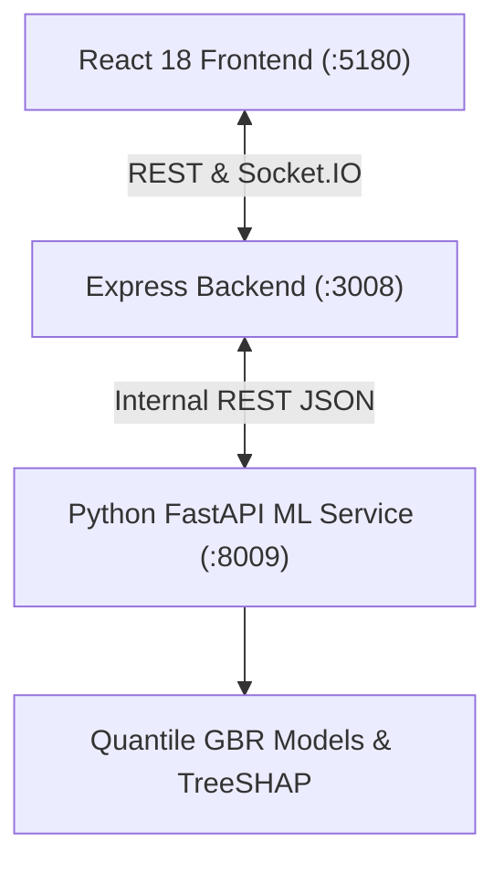

# RailMind (RAILPULSE) — Ministry of Railways API Documentation
**SIH26028 Prototype**: Dynamic Forecast of Expected Time of Arrival (ETA) for Coaching Trains

---

## 1. Architecture Overview

RailMind operates as a distributed microservice system comprising:
1. **Client**: React 18 + Vite + Tailwind CSS + Recharts + Leaflet + Socket.IO Client.
2. **Server**: Node.js + Express + Socket.IO + Mongoose + In-Memory MongoDB engine.
3. **ML Service**: Python 3 + FastAPI + Scikit-Learn Tri-Quantile GBR (`0.05`, `0.50`, `0.95`).



---

## 2. API Endpoints

### A. ML Service Endpoints (`http://127.0.0.1:8009`)

#### 1. `GET /health`
Returns service availability, model loading state, and active model version.
- **Response**: `200 OK`
```json
{
  "status": "healthy",
  "model_version": "gbr-v1-20260908",
  "model_loaded": true
}
```

#### 2. `POST /predict`
Generates tri-quantile delay forecast with calibrated 90% confidence bounds and TreeSHAP explainability factors.
- **Request Body**:
```json
{
  "scheduled_hour": 14,
  "day_of_week": 2,
  "month": 9,
  "is_monsoon": false,
  "weather_condition": "clear",
  "station_index": 4,
  "km_from_origin": 128.0,
  "cumulative_delay_so_far": 4.5,
  "previous_station_delay": 4.0,
  "congestion_level": 0.35,
  "train_type": "Superfast",
  "stop_duration": 2,
  "num_remaining_stops": 6,
  "block_section_occupancy": 1,
  "preceding_train_delayed": 0,
  "trains_queued_in_section": 0
}
```
- **Response**: `200 OK`
```json
{
  "predicted_delay_minutes": 5.2,
  "confidence_lower": 1.5,
  "confidence_upper": 8.8,
  "top_factors": [
    {
      "feature": "Previous Station Delay",
      "importance": 0.9653,
      "value": "4.0 min at previous station"
    },
    {
      "feature": "Track Congestion",
      "importance": 0.0074,
      "value": "Medium congestion (35%)"
    }
  ],
  "model_version": "gbr-v1-20260908"
}
```

#### 3. `POST /predict/whatif`
Sandbox endpoint simulating downstream cascading delay propagation when a primary delay is injected at an upstream station.
- **Request Body**:
```json
{
  "train_number": "22225",
  "train_type": "Superfast",
  "injection_station_code": "KYN",
  "delay_override_minutes": 25.0,
  "cross_train_congestion": true,
  "cross_train_delay_minutes": 12.0,
  "weather_condition": "clear",
  "stations": [
    { "station_code": "CSMT", "station_name": "Mumbai CSMT", "km_from_origin": 0, "scheduled_arrival": "06:00", "current_delay": 0 },
    { "station_code": "KYN", "station_name": "Kalyan Jn", "km_from_origin": 54, "scheduled_arrival": "06:55", "current_delay": 25 }
  ]
}
```

#### 4. `POST /predict/batch`
Multi-train high-throughput batch forecasting endpoint.
- **Request Body**:
```json
{
  "items": [
    { "scheduled_hour": 8, "day_of_week": 1, "station_index": 2, "km_from_origin": 54.0, ... }
  ]
}
```

#### 5. `GET /metrics/evaluation`
Surfaces test set error metrics (MAE, RMSE, R²), 90% PICP calibration coverage, and performance across train classes and weather conditions.

#### 6. `POST /retrain/incremental`
Simulates online batch incremental fine-tuning on live arrival telemetry.

---

### B. Express Backend Endpoints (`http://localhost:3008`)

#### 1. Simulation Controls
- `GET /api/simulation/status`: Returns current simulated time, tick count, speed multiplier.
- `POST /api/simulation/inject-event`: Injects deliberate operational disruption into a train.
- `POST /api/simulation/preset`: Applies operational scenario (`NORMAL`, `MONSOON`, `WINTER_FOG`, `MEGABLOCK`).
- `GET /api/simulation/notifications`: Retrieves active passenger ETA drift notifications.
- `POST /api/simulation/notify-test`: Dispatches a simulated SMS/WhatsApp passenger broadcast.
- `POST /api/simulation/execute-action`: Dispatches conflict resolution order (precedence hold/platform re-berth).

#### 2. Train Telemetry & Predictions
- `GET /api/trains`: Returns nationwide fleet matrix with live speed, coordinates, and delay.
- `GET /api/trains/:trainNumber`: Fetches single train telemetry with full station schedule.
- `GET /api/predictions/:trainNumber`: Retrieves ML prediction timeline for upcoming halts.
- `POST /api/predictions/what-if`: Proxies cascading delay sandbox to ML service.
- `GET /api/predictions/evaluation`: Proxies model metrics and calibration status.
- `POST /api/predictions/retrain`: Triggers online fine-tuning step.
- `GET /api/network/stats`: Network punctuality, active trains, and conflict summary.

---

## 3. Real-Time WebSockets Events

| Channel | Direction | Payload | Description |
|---|---|---|---|
| `trains:fleet` | Server → Client | `Array<Train>` | Continuous full fleet state emitted every tick |
| `train:update` | Server → Client | `TrainRun` | High-priority update on delay event injection |
| `network:stats` | Server → Client | `NetworkStats` | Average network delay & punctuality distribution |
| `conflicts:alerts` | Server → Client | `Array<ConflictAlert>` | Sectional headway conflict & precedence alerts |
| `notification:eta_alert` | Server → Client | `EtaNotification` | Passenger SMS/WhatsApp alert on ETA drift >10 min |
| `scenario:preset_applied` | Server → Client | `{ preset, description }` | Network-wide weather/maintenance scenario sync |
