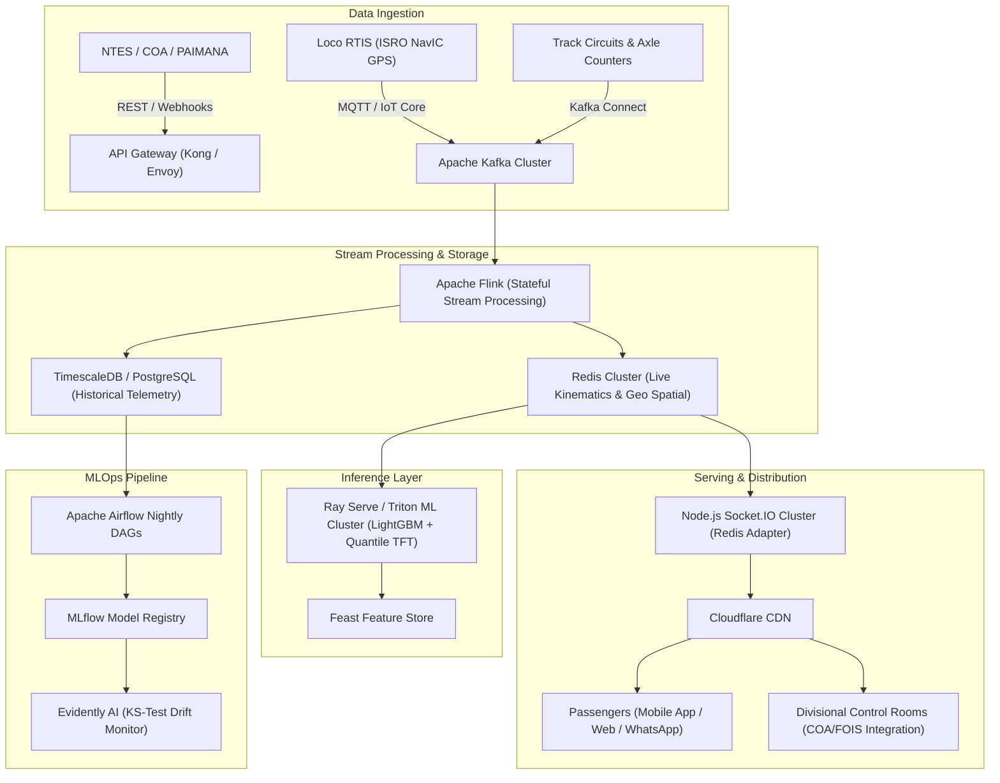

# RailMind (RAILPULSE) — Production Architecture & Scalability Blueprint
**Indian Railways Network Scale**: 13,000+ Daily Coaching Trains • 7,325 Stations • 68,000 km Track

---

## 1. Executive Summary

This document specifies the target production architecture required to transition the RailMind prototype from an in-memory simulation to a nationwide enterprise platform capable of ingesting high-frequency GPS/RFID telemetry from 13,000+ simultaneous trains and serving real-time calibrated ETA forecasts to millions of concurrent passengers and section controllers.

---

## 2. High-Level Enterprise Topology

---

## 3. Core Scalability Pillars

### 1. High-Throughput Stream Ingestion (Apache Kafka & Flink)
- **Scale**: 13,000 locomotives emitting NavIC GPS pings every 5–10 seconds (~2,600 events/sec peak).
- **Ingestion**: Partitioned Apache Kafka topics (`loco.telemetry.v1`, `station.arrivals.v1`, `signal.aspects.v1`).
- **Processing**: Apache Flink computes moving window kinematic features (current speed, acceleration, block occupancy, preceding train headway) with sub-100ms latency.

### 2. Low-Latency In-Memory State (Redis Cluster & Geospatial Index)
- Train coordinates indexed in Redis via `GEOADD` and `GEORADIUS` to enable sub-millisecond proximity queries.
- Socket.IO servers deployed behind an AWS ALB with `@socket.io/redis-adapter` ensuring horizontally scalable state across 20+ Node.js pods.

### 3. High-Performance Model Serving (Triton / Ray Serve & LightGBM)
- **Model Evolution**:
  - Prototype: Gradient Boosting Regressor (Scikit-Learn).
  - Production: LightGBM / XGBoost for fast tabular scoring (<2ms per train), combined with Temporal Fusion Transformers (TFT) for multi-horizon forecasts (12h, 24h ahead).
- **Batch Endpoint**: `/predict/batch` deployed on Ray Serve with dynamic micro-batching to score up to 1,000 trains concurrently in <15ms.

### 4. Automated Retraining & MLOps (Airflow + MLflow + Evidently AI)
- **Nightly Retraining**: Airflow DAG ingests rolling 90-day historical actuals from TimescaleDB at 02:00 AM IST.
- **Model Promotion**: Automated validation comparing candidate model vs champion model (MAE improvement threshold >= 3%, 90% PICP calibration coverage between 88% and 92%).
- **Drift Monitoring**: Evidently AI monitors input feature distributions (covariate shift) and prediction error distributions (concept drift), alerting section engineers if Wasserstein distance > threshold.

### 5. Multi-Channel Passenger Distribution (SMS / WhatsApp Gateway)
- Integration with Indian Railways RailMadad / IRCTC SMS gateway and WhatsApp Business API.
- Intelligent deduplication: Alert sent only when revised ETA drifts >= 10 minutes from previous broadcast to prevent message fatigue.
